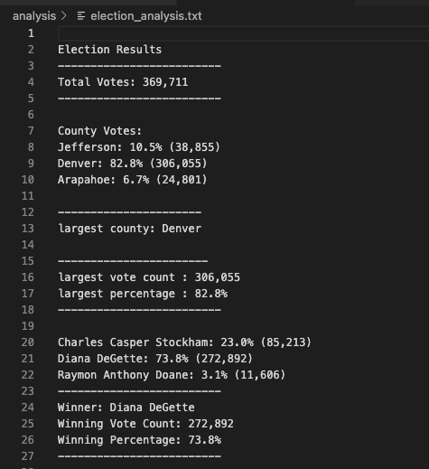
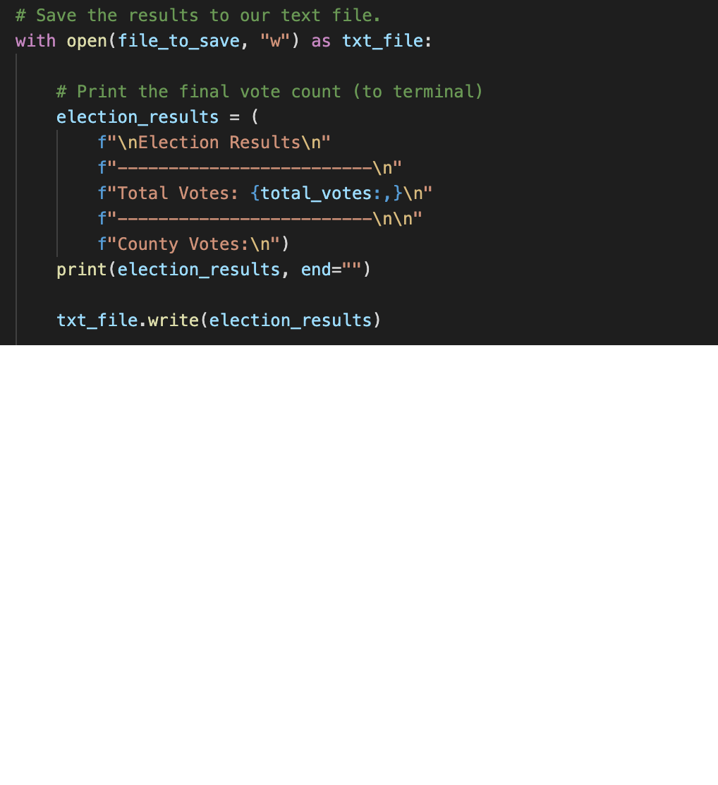
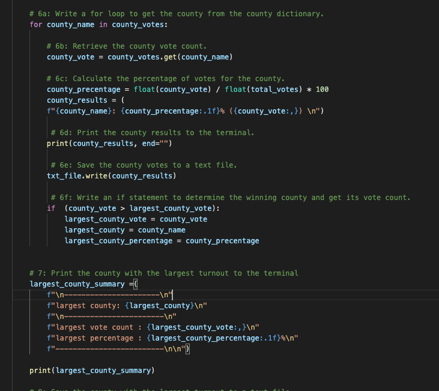
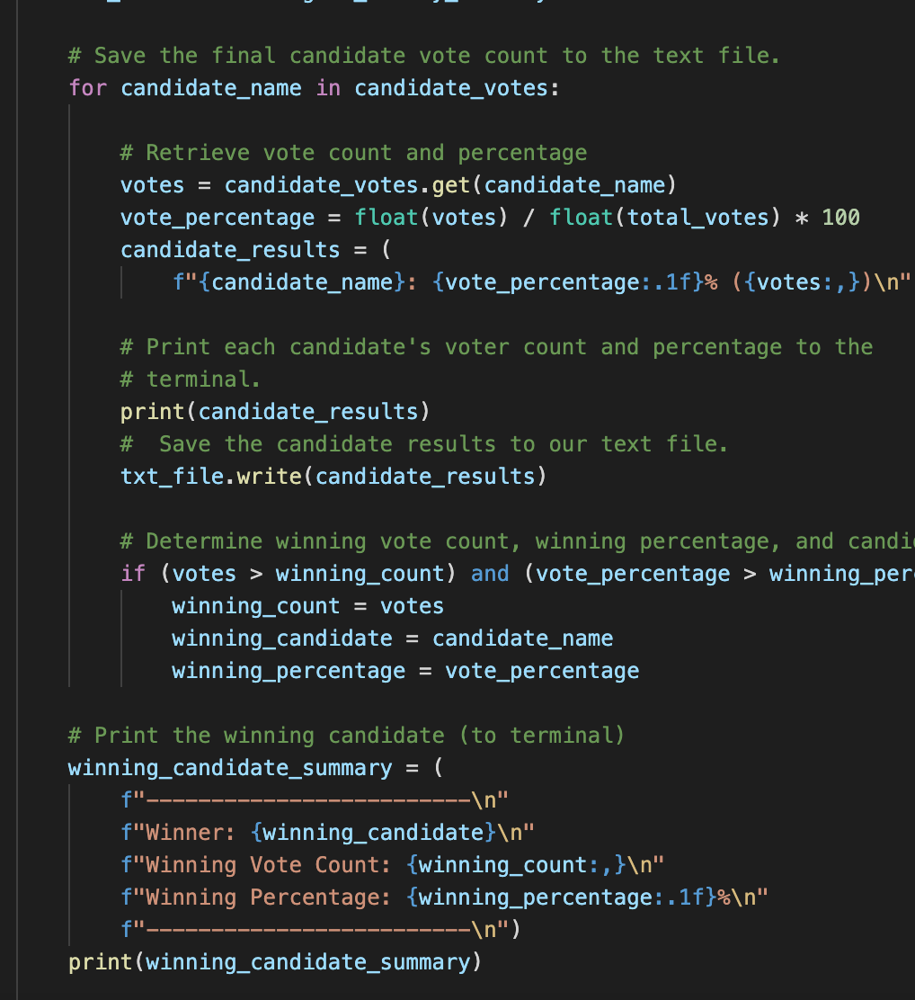

# Election_Analysis

## Overview of Election Audit

### Purpose
The main theme of this election anaylsis is using the python programming language to anaylsis the major information like how many votes in each country to calculate which is the winning vote county. In order to overall the results to political candidates.

## Election-Audit Results:
The total votes have 369,711 in this congressional election.

In the total votes was counted from 3 counties.
1. Jefferson county has 38,855 votes and the proportion of the total votes is 10.5%.
2. Denver county has 306,055 votes and the proportion of the total votes is 82.8%
3. Arapahone county has 24,801 votes and the proportion of the total votes is $6.7%

In the percentage from each county, we can figuare out Denver has the largest number of votes.

The vote in each candidate:
1. Charles Casper Stockham has 85,213 votes and the proportion of the total votes is 23%
2. Diana DeGette has 272,892 votes and the proportion of the total votes is 73.8%
3. Raymon Anthony Doane has 11,606 and proportion of the total votes is 3.1%

According to the election anaylsis, the candidate Diana DeGette won the election. Diana DeGette has 272,892 votes more than another two candidate and the percentage of the total votes is $73.8%

## Election-Audit Summary
There reveiw the picture wiht different kind of script to anaylsis the total votes, largest county summary and winning canidate summary.

The total votes in the election:
This is only count on the total votes from the data without analysis the detail for which couty or canidate have high percentage.

The largest county summary in the election:
This script more focus on how to figure out which on is the largest county.

The winning canidate summary in the election:
It using the similar script to pull out the data on votes of canidate.
